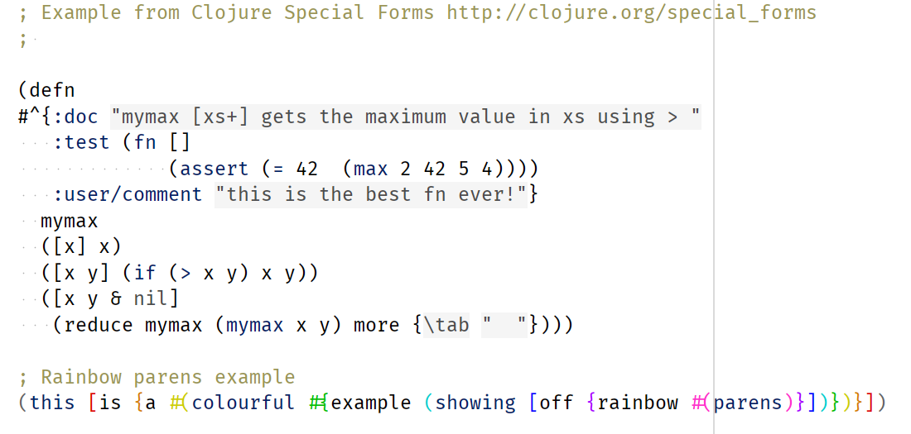

# Stamina light color scheme
Light color scheme with minimal amount of colors.

- Light color scheme, black text on white background.
- Only 3 colors: black/grays and blues for code, yellow/brown for comments.
- Nothing stans out of the code text except of comments which are not a “code” :-)
- String literals and block comments with background to accentuate their scope.

Clojure example:

See examples for other languages in the repository.
